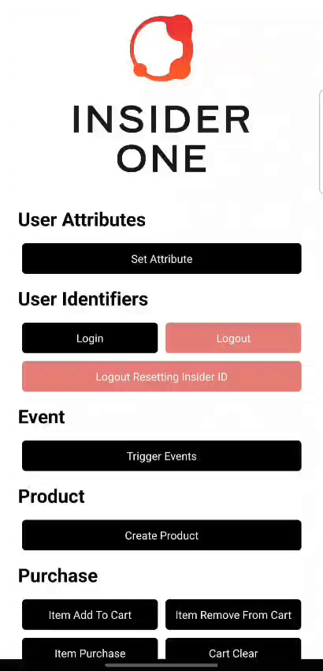

# ExpoDemo (Managed Workflow)

<p align="center">
  
  
  <table align="center">
    <tr>
      <td><a href="https://useinsider.com/"> Insider </a></td>
      <td><a href="https://www.npmjs.com/package/react-native-insider/"> NPM JS react-native-insider </a></td>
      <td><a href="https://www.npmjs.com/package/expo-insider-plugin/"> NPM JS expo-insider-plugin </a></td>
      <td><a href="https://academy.useinsider.com/docs/react-native-integration"> InsiderAcademy </a></td>
    </tr>
  </table>
</p>  

## Description

This Expo Router demo application contains simple methods that you can use with the Insider SDK. The project demonstrates various Insider SDK features including user attributes, events, products, purchases, smart recommender, social proof, content optimizer, GDPR, message center, geofence, in-app messages, and wishlist.

## Preview

<table align="center">
  <tbody>
    <tr>
      <td></td>
    </tr>
  </tbody>
</table>

## Prerequisites

- Node.js (v18 or higher recommended)
- npm or yarn
- Expo CLI (`npm install -g expo-cli`)
- EAS CLI (`npm install -g eas-cli`) - for building the app
- Expo account (sign up at [expo.dev](https://expo.dev))

## Installation

1. Install all npm packages by running the following command in the home directory:

   ```bash
   npm install
   ```

2. Replace partner name and app group values in `app/_layout.tsx` with your Insider credentials.

   **Note:** You can easily find the warnings added as comments by searching the `FIXME-INSIDER` key in the project and quickly make the necessary arrangements for your project.

3. Update `app.json` with your Insider configuration:
   - Replace `partnerName`,
   - Replace `appGroup` value,
   - Replace `developmentTeam` with your Apple Team ID in `expo-insider-plugin` configuration
   - Replace `bundleIdentifier` for iOS in ios configuration
   - Replace `package` for Android in android configuration

4. **Important:** Before building the project, connect it to EAS (Expo Application Services):
   - Visit [https://expo.dev/new](https://expo.dev/new)
   - Select **"Migrate your existing app"** option
   - Follow the instructions to link your project to EAS
   - This step is required before running any build commands

5. Configure EAS Build (if not already done):

   ```bash
   eas build:configure
   ```

## Running the Project

### Development Mode

Start the development server:

```bash
npm start
# or
npx expo start
```

**Note:** This project uses native modules (Insider SDK), so you cannot use Expo Go. You need to create a development build.

### Creating Development Builds

Since this project uses native modules, you need to create a development build using EAS Build:

```bash
# For iOS
eas build --platform ios --profile development

# For Android
eas build --platform android --profile development
```

After the build completes, you'll receive a QR code or download link. Install the build on your device/simulator, then run `npx expo start` to connect to the development server.

### Preview Builds

To create preview builds for testing:

```bash
# For iOS
eas build --platform ios --profile preview

# For Android
eas build --platform android --profile preview
```

### Production Builds

To create production builds:

```bash
# For iOS
eas build --platform ios --profile production

# For Android
eas build --platform android --profile production
```

## Platform-Specific Configuration

### Android

1. Add `google-services.json` to the root directory of the project (required for Firebase/Google Services).

2. Update `app.json`:
   - The `expo-insider-plugin` automatically configures Android manifest placeholders. Ensure your `partnerName` is correctly set in the plugin configuration. (This step is important to add test device with QR or Email in the panel.)
   - Update `package` value with your Android package name.

3. Build using EAS:

   ```bash
   eas build --platform android --profile development
   ```

### iOS

1. Update `app.json`:
   - Ensure `bundleIdentifier` is set correctly
   - Update `appGroup` value (must match across all app extensions)
   - Update `developmentTeam` with your Apple Team ID
   - The `expo-insider-plugin` automatically configures:
     - App Groups for all targets
     - URL Types with your partner name
     - Notification Service Extensions
     - All necessary entitlements

2. Build using EAS:

   ```bash
   eas build --platform ios --profile development
   ```

**Note:** In managed workflow, all native configurations are handled through `app.json` and the `expo-insider-plugin`. You don't need to manually edit Xcode project files or native code.

## Implementation Notes

### iOS Deep Link Handling

On iOS, when connecting to QR codes or links sent via Insider email in Insider InOne, Expo Router may attempt to automatically redirect to a page. To prevent this automatic redirection, we've implemented a middleware workaround using the `+native-intent.tsx` file. This file intercepts deep link paths and prevents Expo Router from handling Insider-specific links, allowing the Insider SDK to process them correctly.

**Important:** Make sure to replace `{YOUR_PARTNER_NAME}` in `app/+native-intent.tsx` with your actual Insider partner name. The path check should match your Insider deep link format (e.g., `insiderYOUR_PARTNER_NAME`).

### Firebase Background Push Notifications

To observe push notifications from Firebase when the app is killed, we've implemented a middleware solution in `index.js`. Additionally, we've configured the project's main entry point in `package.json` to use `index.js` instead of the default Expo Router entry. This file imports `expo-router/entry` to maintain Expo Router functionality while also registering a Firebase background message handler. This workaround ensures that push notifications are properly handled even when the app is not running in the foreground.

ref: https://docs.expo.dev/router/installation/#custom-entry-point-to-initialize-and-load

## Project Structure

```
ExpoDemo-MW/
├── app/                    # Expo Router pages
│   ├── _layout.tsx        # Root layout with Insider initialization
│   └── (tabs)/            # Tab navigation
│       ├── _layout.tsx
│       └── index.tsx      # Main screen
├── components/            # React components
│   └── insider/          # Insider SDK integration components
├── assets/               # Images and static assets
├── constants/            # App constants
├── hooks/               # Custom React hooks
├── app.json             # Expo configuration
└── eas.json             # EAS configuration
```

## Insider SDK Features Demonstrated

- **User Attributes**: Set and update user attributes
- **User Identifiers**: Manage user identification
- **Events**: Track custom events
- **Products**: Product tracking and management
- **Purchases**: Purchase event tracking
- **Smart Recommender**: Product recommendations
- **Social Proof**: Social proof notifications
- **Content Optimizer**: A/B testing and content optimization
- **GDPR**: GDPR compliance features
- **Message Center**: In-app messaging
- **Page Visit**: Page visit tracking
- **Geofence**: Location-based geofence tracking
- **In-App Messages**: In-app message handling and display
- **Wishlist**: Wishlist management and tracking

## Troubleshooting

### Expo Router Issues

If you encounter routing issues:
- Clear Expo cache: `npx expo start -c`
- Rebuild the development client using EAS Build

### Insider SDK Not Initializing

- Verify your partner name and app group are correctly set in `app/_layout.tsx`
- Check that `expo-insider-plugin` is properly configured in `app.json`
- Ensure all configuration values in `app.json` match your Insider account settings
- Rebuild the app after making configuration changes: `eas build --platform {platform} --profile development`

### EAS Build Issues

- Make sure you're logged in: `eas login`
- Check your EAS project is configured: `eas build:configure`
- Verify your Apple Developer account is linked: `eas device:create` (for iOS)
- Check build logs in the Expo dashboard if builds fail

### Development Build Not Connecting

- Ensure you're using a development build (not Expo Go)
- Check that the development server and build are using the same Expo SDK version
- Try clearing cache: `npx expo start -c`

## Learn More

- [Expo Documentation](https://docs.expo.dev/)
- [Expo Router Documentation](https://docs.expo.dev/router/introduction/)
- [EAS Build Documentation](https://docs.expo.dev/build/introduction/)
- [Expo Managed Workflow](https://docs.expo.dev/introduction/managed-vs-bare/)
- [Insider Academy - React Native Integration](https://academy.useinsider.com/docs/react-native-integration)
- [React Native Insider NPM Package](https://www.npmjs.com/package/react-native-insider)
- [Expo Insider Plugin NPM Package](https://www.npmjs.com/package/expo-insider-plugin)

## License

This project is a demo application for Insider SDK integration.
